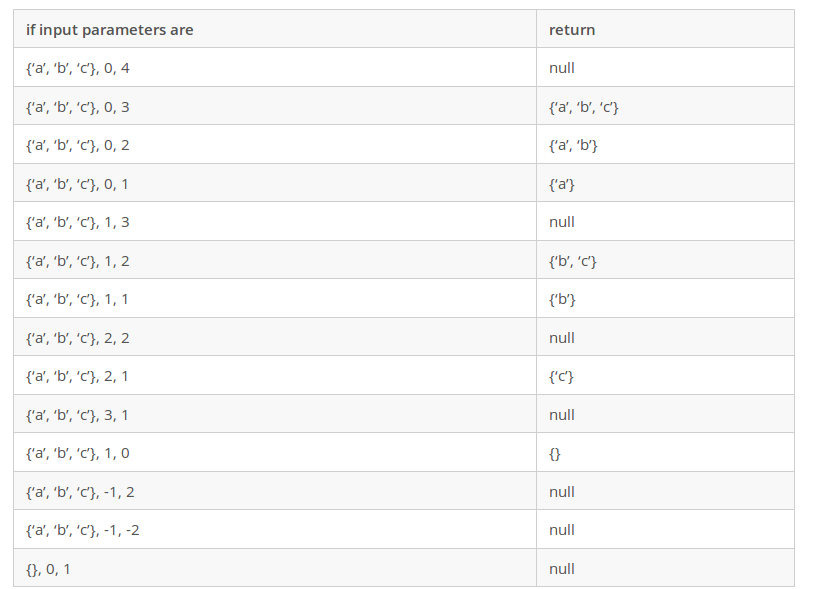

# MS in Computer Science
## Computer Professionals Master's Program Sample Test and Solution in C++

### Qestion 3:
Write a function that accepts a character array, a zero-based start position and a length. It should return a character array containing containing lengthcharacters starting with the startcharacter of the input array. The function should do error checking on the start position and the length and return null if the either value is not legal.
The function signature is:

`char[ ] f(char[ ] a, int start, int len)`

#### Note:
Since were are asked to return an array, I will use `std::vector` which is more flexible than array. [The examiner approved it]

### Solution



#### run
`$ g++ quiz3.cpp`

`$ ./a.out`
#### output

```
{NULL}
{a,b,c,}
{a,b,}
{a,}
{NULL}
{b,c,}
{b,}
{NULL}
{c,}
{NULL}
{ }
{NULL}
{NULL}
{NULL}
-------------------
PASSED!
```
