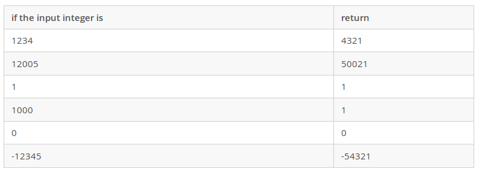

# MS in Computer Science
## Computer Professionals Master's Program Sample Test and Solution in C++

### Qestion 3:
Write a function to reverse an integer using numeric operators and without using any arrays or other data structures.
The signature of the function is:

`int f(int n)`


### Solution



#### run
`$ g++ quiz4.cpp`

`$ ./a.out`
#### output

```
The reverse of 4321 is: 4321
The reverse of 50021 is: 50021
The reverse of 1 is: 1
The reverse of 1 is: 1
The reverse of 0 is: 0
The reverse of -54321 is: -54321
------------------
 PASSED!
```
