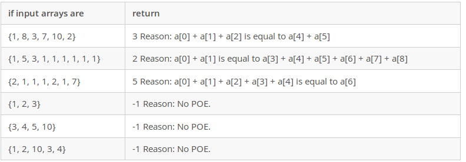

# MS in Computer Science
## Computer Professionals Master's Program Sample Test and Solution in C++

### Qestion 6:
Consider an array A with n of positive integers. An integer idx is called a POE (point of equilibrium) of A, if `A[0] + A[1] + … + A[idx – 1]` is equal to `A[idx + 1] + A[idx + 2] + … + A[n – 1]`. Write a function to return POE of an array, if it exists and `-1` otherwise. 
The signature of the function is:

`int f(int[] a)`

### Hint:
Since we are dealing with arrays, we have to pass in the array with its size. This is because arrays are desolved to pointers inside a function and it will be imposible to get it size.

### Solution



#### run
`$ g++ quiz6.cpp`

`$ ./a.out`
#### output

```
3
2
5
-1
-1
-1
-----------------
 PASSED!
```
